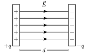
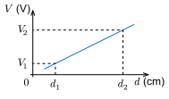
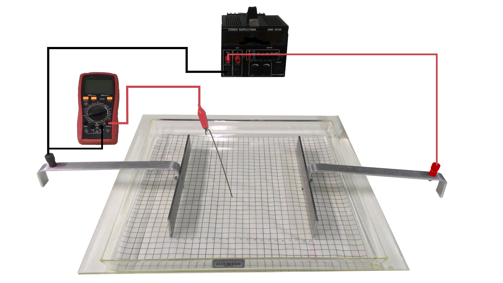

::: {.content-visible when-format="html"}
## Introdução

No século XIX, Michael Faraday introduziu o conceito de _linhas de força_ para explicar o efeito produzido por uma carga eletrizada no espaço ao seu redor. Apesar de imaginárias, tais linhas, hoje denominadas *linhas de campo elétrico*, ajudam a compreender o comportamento dos campos elétricos [@Halliday3].

:::{#fig-campo-eletrico}


<div style="text-align: center; font-size: smaller">
  **Fonte:** Labfis (2026) 
</div>
:::

Como ilustrado na @fig-campo-eletrico, as linhas de campo sempre _começam_ nas cargas positivas e _terminam_ nas cargas negativas. Por outro lado, a cada ponto do espaço, a uma distância $d$ de um dos eletrodos, também esta associado um potencial elétrico $V$, definido de modo que a diferença de potencial entre dois pontos é:

$$
  V = - \int_0^d \vec{E} \cdot d \vec{s}
$${#eq-campo-eletrico}

Considerando o caso especial em que o campo elétrico é constante, resolvendo a integral da @eq-campo-eletrico, tem-se:

\begin{align*}
  V = - \int_0^d \vec{E} \cdot d \vec{s} &\Rightarrow V = - \int_0^d (- E d s)\\
  &\Rightarrow V = E \int_0^d d s \\
  &\Rightarrow V = E d 
\end{align*}

Isolando o campo elétrico $E$, temos:

$$
  E = \dfrac{V}{d}
$${#eq-campo-eletrico-constante}

A @eq-campo-eletrico-constante mostra que no caso do campo elétrico gerado por eletrodos paralelos, a diferença de potencial $V$ em um ponto  é _proporcional_ à distância $d$ entre as placas.

:::{#fig-grafico-potencial-vs-distancia}


<div style="text-align: center; font-size: smaller">
  **Fonte:** Labfis (2026) 
</div>
:::

A relação $V \times d$ é dada por uma reta passando pela origem e cujo coeficiente angular pode ser utilizado para estimar experimentalmente o campo elétrico entre as placas, conforme @fig-grafico-potencial-vs-distancia:

$$
  E_{exp} = \dfrac{V_2 - V_1}{d_2 - d_1}
$${#eq-campo-eletrico-exp}


## Objetivos

1. determinar o campo elétrico entre duas placas paralelas.


## Material Necessário

:::{#fig-grafico-potencial-vs-distancia}
{width="55%"}

<div style="text-align: center; font-size: smaller">
  **Fonte:** Labfis (2026) 
</div>
:::

+ uma cuba com escala projetável comporta por dois eletrodos retos e conexões de fios;
+ uma ponteira para tomada de dados;
+ uma fonte de alimentação VCC com tensão de saída entre 0 V e 30 V;
+ um multímetro ajustado para voltímetro escala de 20 V  CC;
+ mistura de água e sal.


## Referências

:::{#refs}
:::
::::


```{=typst}
#show bibliography: it => {
  show heading: none
  it
}

= Introdução

No século XIX, Michael Faraday introduziu o conceito de _linhas de força_ para explicar o efeito produzido por uma carga eletrizada no espaço ao seu redor. Apesar de imaginárias, tais linhas, hoje denominadas *linhas de campo elétrico*, ajudam a compreender o comportamento dos campos elétricos @Halliday3.

#figure(
  image("assets/images/typst/linhas-campo-eletrico.svg"),
  caption: [Campo elétrico entre duas placas paralelas]
)<fig-campo-eletrico>
#align(center)[#text(size: 10pt)[Fonte: Labfis (2026)]]

//A @fig-campo-eletrico ilustra que as linhas de campo são dotadas das propriedades:

//- em qualquer ponto do espaço, as linhas de campo têm a mesma direção e sentido do vetor campo elétrico no ponto;
//- a distribuição das linhas de campo no espaço é tal que a quantidade de linhas por unidade de área deve ser proporcional à intensidade do campo elétrico.

Como ilustrado na @fig-campo-eletrico, as linhas de campo sempre _começam_ nas cargas positivas e _terminam_ nas cargas negativas. Por outro lado, a cada ponto do espaço, a uma distância $d$ de um dos eletrodos, também esta associado um potencial elétrico $V$, definido de modo que a diferença de potencial entre dois pontos é:

$
  V = - integral_0^d arrow(E) dot d arrow(s)
$<eq-campo-eletrico>

Considerando o caso especial em que o campo elétrico é constante, resolvendo a integral da @eq-campo-eletrico, tem-se:

$
  V = - integral_0^d arrow(E) dot d arrow(s) &arrow.double V = - integral_0^d (- E d s)\
  &arrow.double V = E integral_0^d d s \
  &arrow.double V = E d  \
  &arrow.double E = V/d
$<eq-campo-eletrico-constante>

A @eq-campo-eletrico-constante mostra que no caso do campo elétrico gerado por eletrodos paralelos, a diferença de potencial $V$ em um ponto  é _proporcional_ à distância $d$ entre as placas.

#figure(
  caption: [Gráfico de $V times d$],
  image("assets/images/typst/grafico-potencial-vs-distancia.svg")
)<fig-grafico-potencial-vs-distancia>
#align(center)[#text(size: 10pt)[Fonte: Labfis (2026)]]

A relação $V times d$ é dada por uma reta passando pela origem e cujo coeficiente angular pode ser utilizado para estimar experimentalmente o campo elétrico entre as placas, conforme @fig-grafico-potencial-vs-distancia:

$
  E_("exp") = (V_2 - V_1)/(d_2 - d_1)
$<eq-campo-eletrico-exp>

#pagebreak()

= Objetivos

+ determinar o campo elétrico entre duas placas paralelas.


= Material Necessário

+ uma cuba com escala projetável comporta por dois eletrodos retos e conexões de fios;
+ uma ponteira para tomada de dados;
+ uma fonte de alimentação VCC com tensão de saída entre 0 V e 30 V;
+ um multímetro ajustado para voltímetro escala de 20 V  CC;
+ mistura de água e sal.

#figure(
  image("assets/images/aparato-campo-eletrico.png"),
  caption: [Aparato experimental]
)<fig-aparato-experimental>
#align(center)[#text(size: 10pt)[Fonte: Labfis (2026)]]


= Procedimentos

+ Execute a montagem conforme a Figura @fig-aparato-experimental.

+ Posicione os eletrodos retos em paralelo e separados por uma distância $ d = 20$ cm.

+ Adicione a mistura de água e sal na cuba acrílica o suficiente para definir os contornos dos eletrodos retos.

+ Ligue a fonte de alimentação e regule-a para $V = 15$ Volts.

+ Aplicando a @eq-campo-eletrico-constante, o _valor esperado_ do campo elétrico teórico $E_("esp")$ entre os eletrodos é:

$
  E_("esp") = V/d &arrow.double E_("esp") = 15/20 \
  &arrow.double E_("esp") = 0,75 "V/cm"
$

+ Posicione a ponteira entre os eletrodos retos. Para cada distância $d$ da @tbl-dados meça a diferença de potencial $V$.

#figure(
  kind: table,
  caption: [Coleta de dados],
)[
  #table(
    columns: (2.5cm, 2.5cm),
    table.header([$d$ (cm)], [$V$ (V)]),
    [2], [],
    [4], [],
    [6], [],
    [8], [],
    [10], [],
    [12], [],
    [14], [],
    [16], [],
    [18], [],
    [20], [],
  )
]<tbl-dados>


+ Com os dados da Tabela @tbl-dados, construa o gráfico diferença de potencial $V$ em função da distância $d$ (Use a área da @fig-grafico-exp). 

+ Calcule o coeficiente de inclinação da reta construída no item anterior (Use a @eq-campo-eletrico-exp). Este será o _valor experimental_ do campo elétrico  ($E_("exp")$).

  $
    "Erro" (%) = abs( (E_("exp") - E_("esp")) / E_("esp")) times 100 %
  $<eq-desvio-perc>

+  Utilize a @eq-desvio-perc para calcular o erro percentual do experimento. Preencha a @tbl-resultados.

  #figure(
    kind: table,
    caption: [Análise de Resultados],
  )[
    #table(
      columns: (1fr, 1fr, 1fr),
      table.header([$E_("esp")$ (V/cm)], [$E_("exp")$ (V/cm)], [$"Erro" (%)$],),
      [$$], [], []
      
      //table.cell(colspan: 2)[*Média*]
    )
  ]<tbl-resultados>


#set heading(numbering: none)
= Referências

#bibliography("assets/references/references.bib", style: "assets/references/abnt.csl", title: none)

#pagebreak()

#set page(flipped: true, columns: 1)


#figure(
  caption: [Esboço do gráfico $V times d$],
  cetz.canvas({
    import cetz.draw: *
    scale(90%)

    grid((0,0), (22, 16), stroke: (0.7pt+gray))
    line((0, 17), (0,0), (23, 0), mark: (start: "stealth", end: "stealth", fill: black), name: "ax")
    content("ax.start", [$V$ (V)], anchor: "east",padding: 0.2)
    content("ax.end", [$d$ (cm)], anchor: "west", padding: 0.2)

    for i in range(1, 45) {
      if calc.rem(i, 2)==0 {
        line((i/2, -0.2), (i/2, (0.2)))
        let l = i/2
        if calc.rem(l, 2)==0 {
          content((i/2, -0.2), [$#l$], anchor: "north", padding: 0.2)
        }
      } else {
        line((i/2, -0.15), (i/2, (0.15)))
      }
    }


    for j in range(1, 33) {
      if calc.rem(j, 2)==0 {
        line((-0.2, j/2), (0.2, j/2))
        let m = j/2
        content((-0.2, j/2), [$#m$], anchor: "east", padding: 0.2)
        
      } else {
        line((-0.15, j/2), (0.15, j/2))
      }
    }
  })
)<fig-grafico-exp>

```